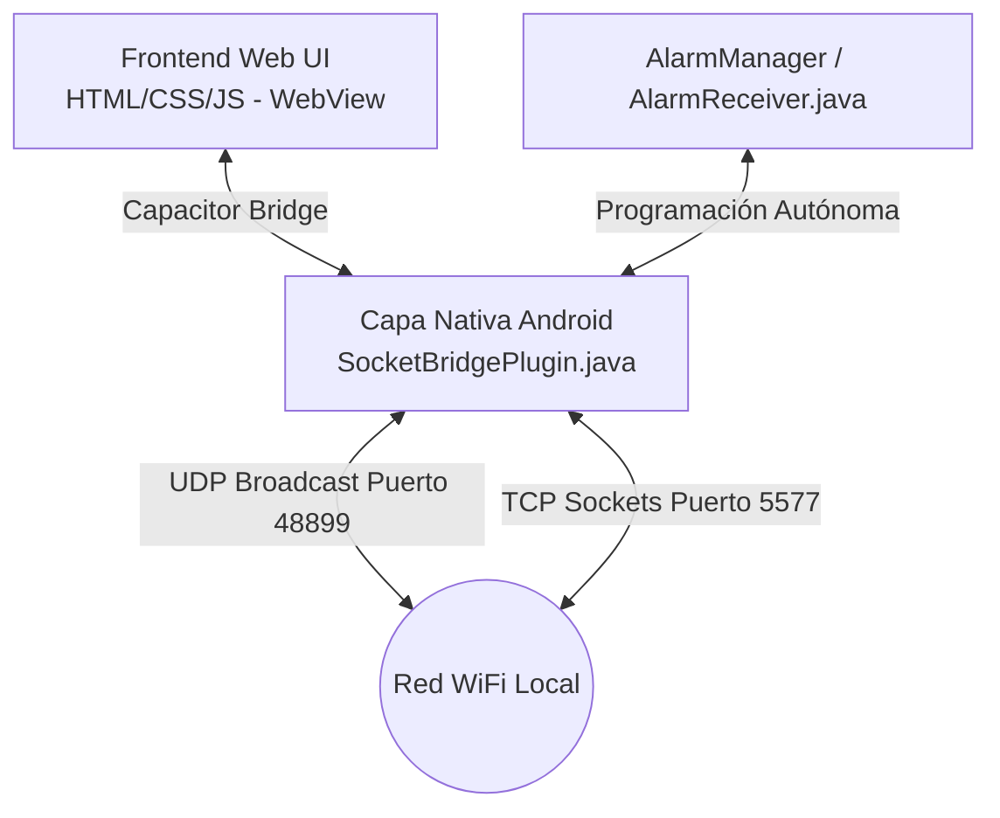

# Documentación Técnica: SmartHome Pro Android App

Esta documentación detalla la arquitectura, tecnologías, dependencias y el funcionamiento interno de la aplicación móvil nativa para Android (`SmartHomePro-Android`).

La aplicación móvil está diseñada para el control local directo de dispositivos inteligentes del ecosistema **Surplife / MagicHome (Zengge)** a través de la red WiFi local, eliminando cualquier dependencia de servidores en la nube y garantizando el funcionamiento autónomo desde el propio dispositivo móvil.

---

## 1. Arquitectura de la Aplicación

La aplicación utiliza un enfoque **híbrido** basado en **Capacitor 6**. 



*   **Frontend (WebView):** Interfaz gráfica de usuario desarrollada en HTML5, CSS3 clásico y JavaScript vanilla, empaquetada dentro de la carpeta `www`. Ofrece un diseño responsivo adaptado a dispositivos móviles con una estética moderna en modo oscuro, efectos de brillo y micro-animaciones.
*   **Capa Nativa (Java):** Un plugin personalizado de Capacitor llamado `SocketBridge` que expone métodos de bajo nivel en Java para manejar sockets TCP/UDP y el `AlarmManager` de Android.
*   **Independencia del Backend:** A diferencia de la versión web de escritorio del proyecto (que utiliza un servidor Flask en Python), la aplicación móvil es **100% autónoma**. Toda la lógica de red local y programación horaria se ejecuta directamente desde el smartphone sin requerir una API externa.

---

## 2. Tecnologías y Dependencias

### Entorno Frontend (NPM)
Las dependencias declaradas en el `package.json` de la aplicación móvil son mínimas, ya que la lógica gráfica corre sobre JavaScript estándar de navegador:

*   **`@capacitor/core` (^6.0.0):** Librería del núcleo del puente de Capacitor.
*   **`@capacitor/android` (^6.0.0):** Soporte de plataforma nativa para compilar en Android.
*   **`@capacitor/cli` (^6.0.0) [dev]:** Interfaz de línea de comandos para la gestión de plataformas, sincronización de archivos estáticos y compilación.

### Componentes y APIs Nativas (Android Java)
*   **Sockets de Red (`java.net.Socket`, `java.net.DatagramSocket`):** Utilizados para interactuar con la red local mediante conexiones de sockets bidireccionales de bajo nivel.
*   **Alarmas del Sistema (`android.app.AlarmManager`):** Utilizado para programar de manera exacta acciones automáticas (encendidos/apagados) a nivel de sistema operativo.
*   **Administrador de Energía (`android.os.PowerManager.WakeLock`):** Utilizado para forzar al procesador a permanecer activo durante el breve tiempo de transmisión del comando de red cuando el dispositivo está en reposo.
*   **Hilos Secundarios (`java.util.concurrent.ExecutorService`):** Un pool de hilos (`CachedThreadPool`) que gestiona las llamadas de red fuera del hilo principal (UI thread) para prevenir bloqueos o la aparición de diálogos de *Application Not Responding (ANR)*.

### Permisos del Sistema (`AndroidManifest.xml`)
Para posibilitar la comunicación de red local y las tareas en segundo plano, la aplicación declara los siguientes permisos:

```xml
<!-- Comunicación TCP/UDP por sockets -->
<uses-permission android:name="android.permission.INTERNET" />
<uses-permission android:name="android.permission.ACCESS_NETWORK_STATE" />
<uses-permission android:name="android.permission.ACCESS_WIFI_STATE" />

<!-- WakeLock para transmisiones sin cortes en modo suspensión -->
<uses-permission android:name="android.permission.WAKE_LOCK" />

<!-- Programación exacta para automatizaciones (Android 12+) -->
<uses-permission android:name="android.permission.SCHEDULE_EXACT_ALARM" />
<uses-permission android:name="android.permission.USE_EXACT_ALARM" />
```

---

## 3. Funcionamiento Interno de la Capa de Red

La comunicación nativa con los dispositivos Surplife está implementada en [SocketBridgePlugin.java](file:///c:/controlador/SmartHomePro-Android/android/app/src/main/java/com/smarthomepro/app/SocketBridgePlugin.java). Se divide en tres áreas funcionales principales:

### A. Descubrimiento de Dispositivos (UDP Broadcast)
La búsqueda automática de dispositivos en la subred se realiza a través del método `scanNetwork`:

1.  Se inicializa un socket de datagramas UDP (`DatagramSocket`) configurado en modo difusión (`setBroadcast(true)`) con un tiempo límite de respuesta (`soTimeout`).
2.  Se envía el payload de búsqueda estándar: `b"HF-A11ASSISTHREAD"` a la IP de difusión global `255.255.255.255` a través del puerto **`48899`**.
3.  Los controladores WiFi compatibles responden enviando un datagrama UDP en formato CSV con su información:
    $$\text{Formato: } \text{IP, Dirección MAC, Modelo de módulo WiFi}$$
    *(Ejemplo: `192.168.1.15,ACC8E0123456,HF-LPB100`)*
4.  El plugin nativo filtra los duplicados y las respuestas de confirmación genéricas (`+ok`) y devuelve un arreglo JSON estructurado al WebView.

### B. Consulta de Estado (TCP Sockets)
Para verificar la disponibilidad y el estado binario del hardware, el método `checkDeviceStatus` realiza lo siguiente:

1.  Establece una conexión TCP de socket al puerto **`5577`** de la IP destino.
2.  Envía una trama binaria de consulta de 4 bytes: `[0x81, 0x8a, 0x8b, 0x96]`.
3.  Lee una respuesta del socket (se esperan al menos 4 bytes).
4.  Si el primer byte de respuesta es `0x81`, analiza el tercer byte (índice 2):
    *   `0x23` representa que el dispositivo está **Encendido (ON)**.
    *   `0x24` representa que el dispositivo está **Apagado (OFF)**.
5.  Resuelve la promesa hacia el frontend con el estado `{ online: true/false, encendido: true/false }`.

### C. Control de Acciones (TCP Sockets)
Para encender, apagar o configurar colores, se invoca `sendTcpCommand` o se envían tramas específicas:

*   **Comandos Binarios Rápidos (4 bytes):**
    *   **Encender (ON):** `[0x71, 0x23, 0x0F, 0xA3]`
    *   **Apagar (OFF):** `[0x71, 0x24, 0x0F, 0xA4]`
*   **Comandos de Modulación Avanzados (25 bytes):**
    Para el ajuste de color RGB o blancos, el frontend JavaScript construye una trama de 25 bytes estructurada:
    
    | Rango de Bytes | Descripción | Valores Comunes |
    | :--- | :--- | :--- |
    | `0` a `3` | Cabecera del protocolo | `0xB0, 0xB1, 0xB2, 0xB3` |
    | `4` a `6` | Metadatos de la trama | `0x00, 0x01, 0x02` |
    | `7` | Contador correlativo de mensajes | `0x00` a `0xFF` |
    | `8` a `9` | Longitud del payload | `0x00, 0x0E` |
    | `10` a `13` | Cabecera interna del payload y Modo de Escritura | `0xE0, 0x01, 0x00, WriteMode`<br>*(Color: 0xA1, Blancos: 0xB1)* |
    | `14` a `16` | Valores HSV de color | `H (Hue/2), Saturation, Value` |
    | `17` a `18` | Temperatura de blancos y Brillo de blancos | `Temp (0-100), Brightness (0-100)` |
    | `19` a `23` | Relleno binario fijo | `0x00, 0x00, 0x14, 0x00, 0x00` |
    | `24` | Checksum de 1 byte | Suma aritmética de los bytes anteriores en máscara `0xFF` |

---

## 4. Sistema Autónomo de Programación de Alarmas

El programador inteligente permite al usuario programar tareas recurrentes en días específicos de la semana sin requerir que la aplicación esté abierta o que exista un backend centralizado.

### Registro de Alarmas (`setAlarm`)
1.  El usuario selecciona una hora, los días de repetición y una acción (encender o apagar).
2.  La capa de presentación almacena los datos en el `localStorage` del WebView para persistencia visual.
3.  Llama al método nativo `setAlarm` pasando los parámetros.
4.  El plugin crea un `PendingIntent` apuntando a [AlarmReceiver.class](file:///c:/controlador/SmartHomePro-Android/android/app/src/main/java/com/smarthomepro/app/AlarmReceiver.java), asignándole un identificador único numérico mediante el hash del `id` de la tarea.
5.  Calcula el tiempo de ejecución inicial utilizando `java.util.Calendar`. Si la hora ya transcurrió en el día actual, calcula la fecha para el día siguiente.
6.  Registra la alarma de forma exacta utilizando:
    *   `alarmManager.setExactAndAllowWhileIdle()` (en Android 6.0+) para evitar que Doze Mode o el sistema de ahorro de energía retrasen la acción.

### Ejecución de Alarmas (`AlarmReceiver.java`)
Cuando se cumple el plazo programado, el sistema operativo despierta al `AlarmReceiver` a través de un broadcast:

1.  **Adquisición de WakeLock:** De inmediato, adquiere un `WakeLock` parcial (`SmartHomePro:AlarmWakeLock`) configurado con un límite estricto de 3 segundos. Esto evita que el CPU vuelva a suspenderse antes de completar la llamada de red.
2.  **Verificación del Día de la Semana:** Compara el día actual (`Calendar.DAY_OF_WEEK`) con la lista de días seleccionados. Si no hay coincidencia, aborta el envío.
3.  **Ejecución de Red:** Si coincide, inicia un hilo secundario (`new Thread`) que abre un socket TCP al puerto `5577` de la IP configurada y transmite el comando binario rápido correspondiente (encendido o apagado).
4.  **Liberación del WakeLock:** Al completarse la transmisión (o al ocurrir un timeout de conexión de 2 segundos), se libera el `WakeLock`.
5.  **Reprogramación Recurrente:** El receptor invoca el método `agendarSiguienteDia`, el cual calcula el instante equivalente para el día de mañana y vuelve a registrar la alarma exacta en el `AlarmManager`. Esto mantiene el ciclo activo de forma indefinida.

---

## 5. Optimizaciones en la Capa del Cliente (JS)

Para asegurar un desempeño fluido y evitar problemas de contención de red, el archivo `index.html` del frontend incorpora técnicas de optimización:

*   **Frecuencia de Muestreo (Color Throttling):** Al usar el selector de color RGB deslizable, la app genera múltiples eventos consecutivos de cambio. Para evitar la saturación de sockets en el hilo nativo, los comandos de color se limitan mediante un temporizador (`colorTimer`) a un máximo de **un envío cada 150 milisegundos**.
*   **Refresco en Segundo Plano Silencioso:** Cada 4 segundos se ejecuta la función `obtenerDispositivosSilencioso()`, la cual consulta el estado actual en paralelo de todos los dispositivos guardados mediante el puente nativo. Los cambios se actualizan modificando clases CSS específicas en los elementos del DOM existentes, evitando el costo de procesamiento de redibujar completamente las tarjetas de dispositivo.
